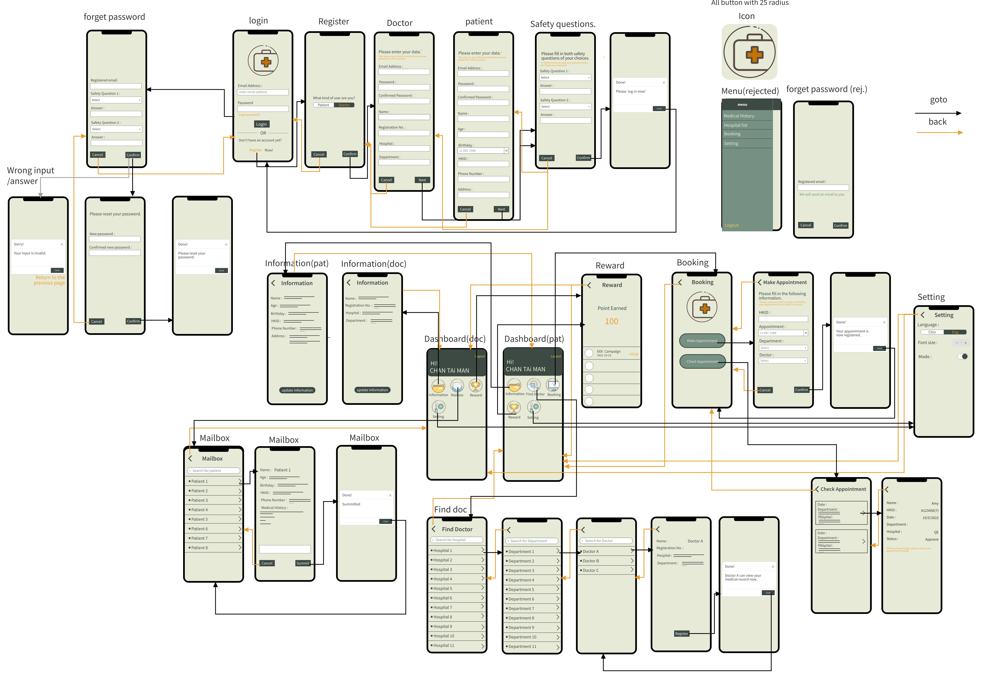

# E-Medical
## Wireframe


## Requirement
### Golang
Install golang from [https://golang.org/dl/](https://golang.org/dl/)
### node
Install node from [https://nodejs.org/en/](https://nodejs.org/en/)
### mongodb
Install mongodb from [https://www.mongodb.com/download-center/community/](https://www.mongodb.com/download-center/community/)

## Configuration
Edit mongo db uri from main.go file. And install all npm packages for web app. Using command:
```
cd webapp
npm install
```

## Running
Run the following command to start the server.
```
go run main.go
```

Run the following command to start the webapp.
```
npm run start
```
